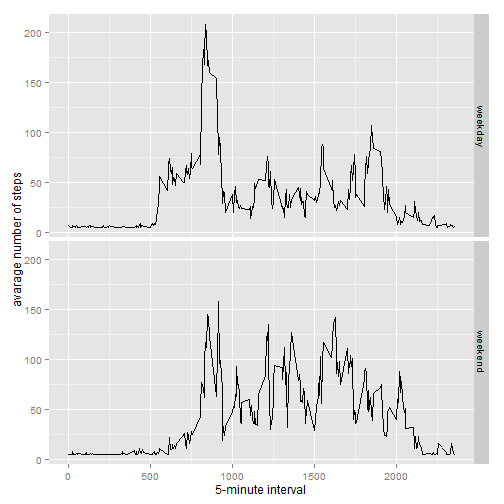

# Reproducible Research: Peer Assessment 1
> Please note that R scripts requires below packages to run

* ggplot2
* scales
* Hmisc

>**Please, install any missing package prior running R code**

> For correct exectution the data file activity.zip must be in the directory
> from which R code is started. The script will verify the existence of unzipped
> content and unpack the data if required.

> activity.zip can be downloaded from https://d396qusza40orc.cloudfront.net/repdata%2Fdata%2Factivity.zip

>**Ensure data file is available prior running any R code**


## Loading the data
##### 1. Load the data (i.e. read.csv())

```r
if(!file.exists('activity.csv')){
    unzip('activity.zip')
}
activityData <- read.csv('activity.csv')
```
-----

## QUESTION 1: What is mean total number of steps taken per day?
##### 1. Calculate steps per each day excluding NA values 

```r
stepsPerDay <- aggregate(steps ~ as.Date(activityData$date, format = "%Y-%m-%d"), activityData, sum)
colnames(stepsPerDay) <- c("date","steps")
```

##### 2. Make a histogram of the total number of steps taken each day

```r
ggplot(stepsPerDay, aes(x = steps)) + 
       geom_histogram(aes(fill = ..count..), origin=0.1, binwidth=1000) +
       labs(title="Histogram of Steps Taken per Day", 
       x = "Number of Steps per Day", y = "Frequency")
```

 

##### 3. Calculate and report the mean and median total number of steps taken per day
###### Apply mean and median functions to stepsPerDay  

```r
stepsPerDayMean <- mean(stepsPerDay$steps, na.rm=TRUE)
stepsPerDayMedian <- median(stepsPerDay$steps, na.rm=TRUE)
```
## Result
* Mean: 10766.189
* Median:  10765

-----

## QUESTION 2: What is the average daily activity pattern?

##### 1. Calculate average steps per interval

```r
averageStepsPerInterval <- aggregate(x=list(meanSteps=activityData$steps), by=list(interval=activityData$interval), FUN=mean, na.rm=TRUE)
```

##### 2. Create a time series plot

```r
ggplot(data=averageStepsPerInterval, aes(x=interval, y=meanSteps)) +
    geom_line() +
    xlab("5-minute interval") +
    ylab("average number of steps taken")
```

 

##### 3. Which 5-minute interval, on average across all the days in the dataset, contains the maximum number of steps?

```r
mostSteps <- which.max(averageStepsPerInterval$meanSteps)
timeMostSteps <-  gsub("([0-9]{1,2})([0-9]{2})", "\\1:\\2", averageStepsPerInterval[mostSteps,'interval'])
```

* Most Steps occurred at: 8:35

----

## QUESTION 3: Imputing missing values
##### 1. Calculate and report the total number of missing values in the dataset 

```r
numMissingValues <- length(which(is.na(activityData$steps)))
```

* Number of missing values: 2304

##### 2. Devise a strategy for filling in all of the missing values in the dataset.

###### Missing values will be evaluated using the calculated mean value.

##### 3. Create a new dataset that is equal to the original dataset but with the missing data filled in.

```r
activityDataImputed <- activityData
activityDataImputed$steps <- impute(activityData$steps, fun=mean)
```


##### 4. Make a histogram of the total number of steps taken each day and Calculate and report the mean and median total number of steps taken per day.

###### Plot Histogram:


```r
stepsPerDayImputed <- tapply(activityDataImputed$steps, activityDataImputed$date, sum)
qplot(stepsPerDayImputed, xlab='Total steps per day (Imputed)', ylab='Frequency', binwidth=1000) + geom_histogram(aes(fill = ..count..), binwidth=1000)
```

 

###### Calculate mean and median total number of steps taken per day.:

```r
stepsPerDayMeanImputed <- mean(stepsPerDayImputed)
stepsPerDayMedianImputed <- median(stepsPerDayImputed)
```
* Mean (Imputed): 10766.189
* Median (Imputed):  10766.189


----

## QUESTION 4: Are there differences in activity patterns between weekdays and weekends?
##### 1. Create a new factor variable in the dataset with two levels - "weekday" and "weekend" indicating whether a given date is a weekday or weekend day.


```r
activityDataImputed$dateType <-  ifelse(as.POSIXlt(activityDataImputed$date)$wday %in% c(0,6), 'weekend', 'weekday')
```

##### 2. Make a panel plot containing a time series plot


```r
averagedActivityDataImputed <- aggregate(steps ~ interval + dateType, data=activityDataImputed, mean)
ggplot(averagedActivityDataImputed, aes(interval, steps)) + 
    geom_line() + 
    facet_grid(dateType ~ .) +
    xlab("5-minute interval") + 
    ylab("avarage number of steps")
```

 

